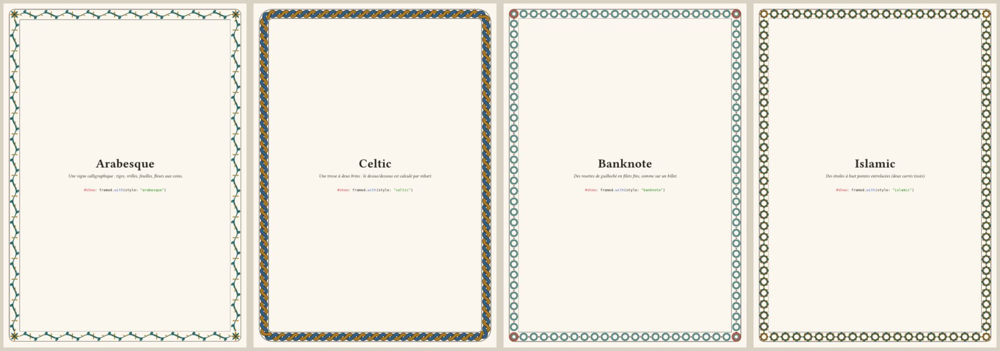
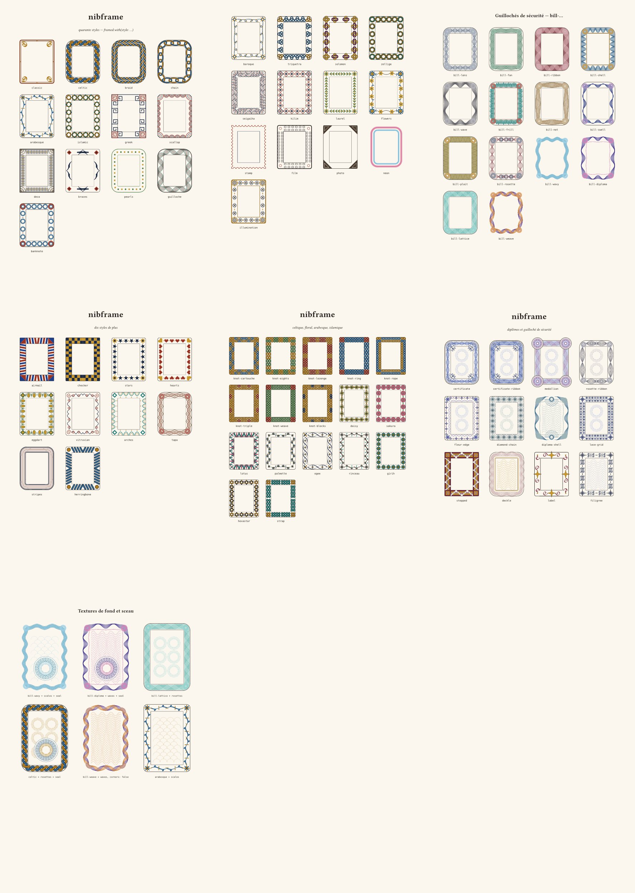

# nibframe

Decorative **frames and borders** for a page — or for any box — drawn with [nibart](https://typst.app/universe/package/nibart):
seventy-nine styles — arabesque, Celtic plait, braid and knotwork, floral garlands, Islamic stars, Greek key, banknote guilloché, Art Deco, chain, braces, pearls, baroque, Solomon knots, zellige, seigaiha, postage stamp, film strip, neon, illumination… Celtic interlace has its over/under computed.
Pure vector geometry: no image, no font, and the frame adapts to any page size.

[Manual (EN)](docs/manual-en.pdf) · [Manuel (FR)](docs/manual-fr.pdf) · [Français](README.fr.md) · [Changelog](CHANGELOG.md)



## Installation

From **Typst Universe** there is nothing to install: `#import "@preview/nibframe:0.3.0": *` (the dependency `nibart` is downloaded automatically).

## Quick start

```typ
#import "@preview/nibframe:0.3.0": *

#show: framed.with(style: "celtic")     // every page gets the frame, and margins that keep the text clear of it

= My document
#lorem(200)
```

Put the show rule first. Options go after the style:

```typ
#import "@preview/nibframe:0.3.0": *
#show: framed.with(style: "guilloche", color: rgb("#1c7a78"), accent: rgb("#9a3324"), band: 14mm, inset: 6mm, gap: 8mm)
```

## Styles

`"classic"`, `"celtic"`, `"braid"`, `"chain"`, `"arabesque"`, `"islamic"`, `"greek"`, `"scallop"`, `"deco"`, `"braces"`, `"pearls"`, `"guilloche"`, `"banknote"`, `"baroque"`, `"triquetra"`, `"solomon"`, `"zellige"`, `"seigaiha"`, `"kilim"`, `"laurel"`, `"flowers"`, `"stamp"`, `"film"`, `"photo"`, `"neon"`, `"illumination"`, `"bill-lens"`, `"bill-fan"`, `"bill-ribbon"`, `"bill-shell"`, `"bill-wave"`, `"bill-frill"`, `"bill-net"`, `"bill-swell"`, `"bill-plait"`, `"bill-rosette"`, `"bill-wavy"`, `"bill-diploma"`, `"bill-lattice"`, `"bill-weave"`, `"airmail"`, `"checker"`, `"stars"`, `"hearts"`, `"eggdart"`, `"vitruvian"`, `"arches"`, `"tapa"`, `"stripes"`, `"herringbone"`, `"knot-cartouche"`, `"knot-eights"`, `"knot-lozenge"`, `"knot-ring"`, `"knot-rope"`, `"knot-triple"`, `"knot-weave"`, `"knot-blocks"`, `"daisy"`, `"sakura"`, `"lotus"`, `"palmette"`, `"ogee"`, `"rinceau"`, `"girih"`, `"hexastar"`, `"strap"`, `"certificate"`, `"certificate-ribbon"`, `"stepped"`, `"deckle"`, `"label"`, `"diamond-chain"`, `"lace-grid"`, `"diploma-shell"`, `"medallion"`, `"rosette-ribbon"`, `"fleur-edge"`, `"filigree"`, `"dedication"`, `"plank"`, `"torn"`, `"coil"` (list: `frame-styles`).



| Style | What it is |
|---|---|
| `classic` | two rules and broad-nib volutes |
| `celtic` | two-strand plait (`strands: 3` for a three-strand braid); over/under computed by nibart |
| `braid` | Celtic double braid: two plaits side by side |
| `chain` | interlocked links |
| `arabesque` | calligraphic vine: stems, tendrils, leaves, corner flowers |
| `islamic` | interlaced eight-pointed stars (two woven squares) |
| `greek` | key meander |
| `scallop` | lace arcs, fans in the corners |
| `deco` | Art Deco ticks and corner fans |
| `braces` | four calligraphic braces |
| `pearls` | a string of pearls between two rules |
| `guilloche` | phase-shifted sine waves |
| `banknote` | guilloché rosettes in fine lines |
| `baroque` | calligraphic scrolls on a wavy stem, leaf tufts, corner flowers |
| `triquetra` | a Celtic trefoil knot per repeat (over/under computed) |
| `solomon` | Solomon's knots: two woven loops per repeat |
| `zellige` | twelve-pointed interlaced stars (three woven squares) |
| `seigaiha` | Japanese wave scales (needs `paper`) |
| `kilim` | chain of nested lozenges |
| `laurel` | laurel leaf pairs along a stem, star corners |
| `flowers` | six-petal flowers on a wavy stem |
| `stamp` | postage-stamp perforations |
| `film` | film strip: rounded sprocket holes |
| `photo` | photo-album corner triangles |
| `neon` | glowing tube: translucent layered strokes |
| `illumination` | gold rules, quatrefoil frieze, sunburst corners (manuscript) |
| `bill-lens` | two crossing bundles of hairlines forming lenses |
| `bill-fan` | waved hairlines with scalloped edge and small rosettes |
| `bill-ribbon` | a twisting ribbon of phase-shifted hairlines |
| `bill-shell` | nested arches, like shells, under three straight rules |
| `bill-wave` | a wave bundle whose amplitude grows across the band |
| `bill-frill` | ruffled lower edge under straight rules |
| `bill-net` | two woven families of waves: a moiré net |
| `bill-swell` | a wave whose hairlines fan out and pinch |
| `bill-plait` | a fine, dense plait of twisted hairlines |
| `bill-rosette` | a chain of lenses with guilloché rosettes |
| `bill-wavy` | undulating outline: two crossing bundles of waves (no straight rules) |
| `bill-diploma` | diploma border: fan of hairlines under a wavy edge, double wavy inner rule |
| `bill-lattice` | a lattice of triangle waves (diamonds and triangles) |
| `bill-weave` | two counter-phased bundles weaving round a wavy outline |
| `airmail` | air-mail diagonal stripes |
| `checker` | two-colour checkerboard |
| `stars` | a row of stars and dots |
| `hearts` | a row of hearts |
| `eggdart` | egg-and-dart moulding |
| `vitruvian` | Vitruvian scroll: a running wave with spirals |
| `arches` | pointed arcade |
| `tapa` | zigzag lines (tapa / chevrons) |
| `stripes` | concentric stripes of different weights |
| `herringbone` | slanted outlined strokes: rope / herringbone |
| `knot-cartouche` | Celtic knotwork tiles: plait closed by loops at both ends |
| `knot-eights` | chain of small closed figure-of-eight knots |
| `knot-lozenge` | knotwork tiles with a lozenge and plaits |
| `knot-ring` | interlaced rings between two plaits |
| `knot-rope` | two rows of interlaced rings (rope) |
| `knot-triple` | three knotwork blocks per tile |
| `knot-weave` | long plait with a central weave |
| `knot-blocks` | alternating closed knot blocks |
| `daisy` | garland of eight-petal daisies with leaves |
| `sakura` | five-petal cherry blossoms on a branch |
| `lotus` | upright lotus flowers alternating with inverted buds |
| `palmette` | palmette fans and curls on a wavy stem |
| `ogee` | chain of almonds with quatrefoils |
| `rinceau` | wave with leaf fans, curls and beads |
| `girih` | eight-pointed star outlines with lozenges |
| `hexastar` | woven hexagrams (Solomon’s seal) |
| `strap` | angular interlaced strapwork |
| `certificate` | guilloché band, beaded outer edge and acanthus flourishes in the corners (optional; try `texture: "rosettes"`) |
| `certificate-ribbon` | same, with interlaced ribbon guilloché |
| `stepped` | interlocking stepped pyramids (castellated edge) |
| `deckle` | waves that fade from a deckled outer edge into straight lines |
| `label` | slim double rule with curls in the corners and a fleuron in the middle of each side |
| `diamond-chain` | chain of nested diamonds with hairline triangles between them |
| `lace-grid` | lace-like grid of small quatrefoils |
| `diploma-shell` | undulating diploma border with a guilloché shell fan in the middle of the top and bottom sides |
| `medallion` | diamond-lattice band with large guilloché discs over the corners |
| `rosette-ribbon` | ribbon of hairlines pinched at regular intervals, a rosette on each pinch |
| `fleur-edge` | scalloped outer edge, four-pointed fleurons, diamond lattice |
| `filigree` | mirrored scrolls with leaves, dense symmetric ornament |
| `dedication` | triple rule, a row of diamonds between the rules, rosettes with leafy sprigs in the corners and in the middle of every side (invitations, dedications) |
| `plank` | four mitred wooden boards with grain and a nail in every corner (a picture frame made of planks) |
| `torn` | strip of torn paper with a ragged outer and inner edge and a soft shadow (the tear is the same on opposite sides) |
| `coil` | rounded notebook border with wire rings along one side (`binding: "left"`, `"right"`, `"top"`, `"bottom"` or `"none"`) |

| Option | Meaning | Default |
|---|---|---|
| `band` | width of the decorative band | `auto`: 5–7.5 mm depending on the style |
| `inset` | distance between the page edge and the band | `4mm` |
| `color`, `accent` | the two colours of the style | blue, ochre |
| `ink` | outlines (celtic, guilloche, braces) | dark brown |
| `paper` | colour of the page, used by the styles that hide overlaps (seigaiha, kilim, photo, baroque) | `white` |
| `corners` | corner ornaments; `false` keeps the continuous contour and the side pattern only | `true` |
| `corner-color` | colour of the corner rosettes of the `bill-*` styles | lighter `accent` |
| `binding` | `coil` only: side of the wire rings (`"left"`, `"right"`, `"top"`, `"bottom"`, `"none"`) | `"left"` |
| `texture` | background texture inside the frame: `"scales"`, `"waves"`, `"rosettes"` (any style) | `none` |
| `texture-color` | colour of the texture | pale `accent` |
| `seal` | a guilloché seal (rosette) in the bottom-right corner of the page | `false` |
| `line` | thin rules | `0.6pt` |
| `radius` | corner radius | depends on the style |
| `period` | length of one repeat of the pattern (celtic, guilloche, pearls) | depends on the style |
| `strands` | celtic: 2 or 3; guilloche: 7 | |
| `rules` | thin rules along both edges (celtic, guilloche, braces) | `true` |

## Functions

- `framed(style:, gap: 6mm, margin: true, ..options)` — show rule; sets the page background and margin (`margin: false` keeps your own margin).
- `frame-background(style:, ..options)` — for `set page(background: …)` when you manage the margins yourself; `frame-margin(style:, gap:, ..options)` returns `inset + band + gap`.
- `frame-box(body, width:, height:, style:, gap:, ..options)` — a framed box around any content (certificate, card, poster). `width`/`height`: `auto` fits the body.
- `frame-graphic(width, height, style:, ..options)` — the frame alone, as content of that size.
- `frame-items(width, height, style:, ..options)` — the raw [nibart](https://typst.app/universe/package/nibart) items for `nibart.mp-fig`, to combine with your own drawing.

## Notes

- The page needs a fixed size (not `auto`). Rendering time grows with the page size for the knotted styles (`celtic`, `braid`, `chain`: a few seconds for an A4 page) and `banknote` (heavier PDF).
- Requires Typst 0.15 (nibart uses a WebAssembly plugin).

Examples in the repository: [`examples/gallery.typ`](examples/gallery.typ) (all styles), [`examples/frames.typ`](examples/frames.typ) (four full pages + a certificate); `--input lang=en` for English captions.

## Licence

Author: **FERGOUS Abdelhak** ([@fergousA](https://github.com/fergousA)) · repository: <https://github.com/fergousA/nibframe>.  
[MIT](LICENSE).
